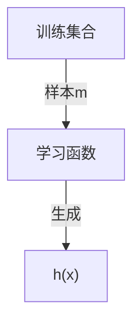

# 【机器学习】算法原理详细推导与实现(一):线性回归

今天我们这里要讲第一个有监督学习算法，他可以用于一个回归任务，这个算法叫做 **线性回归**

## 房价预测

假设存在如下 `m` 组房价数据：

| 面积(m^2)| 价格(万元) | 
|:----:|:----:|
| 82.35 | 193 |
| 65.00 | 213 |
| 114.20 | 255 |
| 75.08 | 128 |
| 75.84 | 223 |
| ... | ... |

通过上面的数据，可以做出如下一个图。横坐标是 `面积(m^2)`，纵坐标是 `价格(万元)`：

那么问题来了，给你这样一组数据，或者给你这样一个训练数据的集合，能否预测房屋的面积大小和房价之间的关系？

### 构建函数

存在如下符号假设：

> **m** 为训练数据
> **x** 为输入特征，即房子的大小
> **y** 为输出结果，即房子的价格
> **(x, y)** 为一个样本，即表格中一行代表一个训练样本
> $(x^{(i)}, y^{(i)})$ 为第 **i** 个训练样本

在监督学习中，我们一般会这样做：

>1. 首先找到一个训练集合
>2. 提供样本 **m** 给算法构建学习函数
>3. 算法会生成一个学习函数，用 $h(x)$ 表示
>4. 给学习函数提供足够的样本$x$，由此输出结果$y$

**学习函数**

**训练函数**

为了设计学习算法(学习函数)，假设存在如下函数：

$$
h(x)=\theta_0+\theta_1x
$$

其中 $x$ 是一个输入函数，这里代表输入的面积(m^2)，$h(x)$ 是一个输出函数，这里代表 输出的价格(万元)，$\theta$ 是函数的参数，是需要根据样本学习的参数。对于如上的学习函数只是一个简单的二元一次方程，只需要两组样本 $(x_0,y_0)，(x_1,y_1)$ 就能将 $\theta_0,\theta_1$ 学习出来，这是一个很简单的函数，但是这样在实际情况中并非很合理。

但是影响房子价格的因素不仅仅是房子的大小。除了房子的大小之外，假设这里还知道每个房子的房间数量：

| 面积(m^2)|房间(个)| 价格(万元) | 
|:----:|:----:|:----:|
| 82.35 | 2 | 193 |
| 65.00 | 2 | 213 |
| 114.20 | 3 | 255 |
| 75.08 | 2 | 128 |
| 75.84 | 2 | 223 |
| ... | ... | ... |

那么我们的训练集合将有第二个特征，$x_1$表示房子的面积(m^2)，$x_2$表示房子的房间(个)，这是学习函数就变成了：

$$
h(x)=\theta_0+\theta_1x_1+\theta_2x_2=h_\theta(x)
$$

$\theta$被称为参数，决定函数中每个特征$x$的影响力（权重）。$h_\theta(x)$ 为参数为 $\theta$ 输入变量为$x$的学习函数。如果令$x_0=1$，那么上述方程可以用求和方式写出，也可以转化为向量方式表示：

$$
\begin{split}
h_\theta(x)&=\theta_0x_0+\theta_1x_1+\theta_2x_2 \\
&=\sum^2_{i=0}{\theta_ix_i} \\
&=\theta^Tx \\
\end{split}
$$

假设存在$m$个特征$x$，那么上述公式求和可以改成：

$$
\begin{split}
h_\theta(x)&=\sum^m_{i=0}{\theta_ix_i} \\
&=\theta^Tx \\
\end{split}
$$

### 训练参数

在拥有足够多的训练数据，例如上面的房价数据，怎么选择(学习)出参数$\theta$出来？一个合理的方式是使学习函数$h_\theta(x)$ 学习出来的预测值无限接近实际房价值 $y$。假设**单个样本误差**表示为：

$$
j(\theta)=\frac{1}{2}(h_\theta(x^{(i)})-y^{(i)})^2
$$

我们把 $j(\theta)$ 叫做单个样本的误差。至于为什么前面要乘$\frac{1}{2}$，是为了后面计算方便。

为了表示两者之间的接近程度，我们可以用训练数据中所有样本的误差的和，所以定义了 **损失函数** 为：

$$
\begin{split}
J(\theta)&=j_1(\theta)+j_2(\theta)+...+j_m(\theta) \\
&=\frac{1}{2}\sum^m_{i=1}{(h_\theta(x^{(i)})-y^{(i)})^2} \\
\end{split}
$$

而最终的目的是为了使误差和 $min(J(\theta))$ 最小，这里会使用一个搜索算法来选取 $\theta$ 使其误差和无限逼近 $J(\theta)$ 最小，其流程是：

>1. 初始化一组向量 $\vec{\theta}=\vec{0}$
>2. 不断改变 $\theta$ 的值使其 $J(\theta)$ 不断减小
>3. 直到取得 $J(\theta)$ 最小值，活得得到最优的参数向量 $\vec{\theta}$

该搜索算法为 **梯度下降**，算法的思想是这样的，下图看到显示了一个图形和坐标轴，图像的高度表示误差和  $J(\theta)$，而下面的两条坐标表示不同的参数 $\theta$ ，这里为了方便看图只是显示了 $\theta_0$ 和 $\theta_1$ ，即变化参数 $\theta_0$ 和 $\theta_1$ 使其误差和  $J(\theta)$ 在最低点，即最小值。

首先随机选取一个点 $\vec{\theta}$ ，它可能是 $\vec{0}$ ，也可能是随机的其他向量。最开始的 **+** 字符号表示开始，搜索使其 $J(\theta)$ 下降速度最快的方向，然后迈出一步。到了新的位置后，再次搜索下降速度最快的方向，然后一步一步搜索下降，梯度下降算法是这样工作的：

梯度下降的核心就在于每次更新 $\theta$ 的值，公式为：

$$
\theta_j:=\theta_j-\alpha\frac{\partial J(\theta)}{\partial\theta_j}\tag{1}
$$

上面公式代表：$\theta_j$ 每次都按照一定的 **学习速率** $\alpha$ 搜索使误差和 $J(\theta)$ 下降最快的方向更新自身的值。而 $\frac{\partial J(\theta)}{\partial\theta_j}$ 是 $J(\theta)$ 的偏导值，求偏导得到极值即是下降最快的方向。假设在房价的例子中，只存在一组训练数据 $(x,y)$，那么可以推导如下公式：

$$
\begin{split}
\frac{\partial J(\theta)}{\partial\theta_j}&=\frac{\partial}{\partial\theta_j}\frac{1}{2}(h_{\theta}(x)-y)^2 \\
&=2\frac{1}{2}(h_{\theta}(x)-y)\frac{\partial}{\partial\theta_j}(h_{\theta}(x)-y) \\
&=(h_{\theta}(x)-y)\frac{\partial}{\partial\theta_j}(\sum^m_{i=0}{\theta_ix_i}-y) \\
&=(h_{\theta}(x)-y)\frac{\partial}{\partial\theta_j}(\theta_0x_0+\theta_1x_1+...+\theta_mx_m-y) \\
&=(h_{\theta}(x)-y)x_j \\
\end{split}\tag{2}
$$

结合 $(1)(2)$ 可以得到：

$$
\theta_j:=\theta_j-\alpha(h_{\theta}(x)-y)x_j\tag{3}
$$

对于存在 $m$ 个训练样本，$(1)$ 转化为：

$$
\theta_j:=\theta_j-\sum^m_{i=1}\alpha(h_{\theta}(x^{(i)})-y^{(i)})x_j\tag{4}
$$

**学习速率** $\alpha$ 是梯度下降的速率，$\alpha$ 越大函数收敛得越快，$J(\theta)$ 可能会远离最小值，精度越差；$\alpha$ 越小函数收敛得越慢，$J(\theta)$ 可能会靠近最小值，精度越高。下面就是下降寻找最小值的过程，在右图 $J(\theta)$ 越来越小的时候，左边的线性回归越来准：

## 代码

选取得到的 **150条二手房** 数据进行预测和训练，拟合情况如下：

计算损失函数：

~~~ruby
# 损失函数
def computeCost(X, y, theta):
    inner = np.power(((X * theta.T) - y), 2)
    return np.sum(inner) / (2 * len(X))
~~~

梯度下降函数为：

~~~ruby
# 梯度下降函数
def gradientDescent(X, y, theta, alpha, iters):
    temp = np.matrix(np.zeros(theta.shape))
    parameters = int(theta.ravel().shape[1])
    cost = np.zeros(iters)

    for i in range(iters):
        error = (X * theta.T) - y

        for j in range(parameters):
            term = np.multiply(error, X[:, j])
            temp[0, j] = theta[0, j] - ((alpha / len(X)) * np.sum(term))

        theta = temp
        cost[i] = computeCost(X, y, theta)

    return theta, cost
~~~

训练迭代1000次后得到参数 $\theta$：

~~~ruby
# 训练函数
def train_function():
    X, y, theta = get_training_dataset()
    # 有多少个x就生成多少个theta
    theta = np.matrix(np.zeros(X.shape[-1]))
    # 查看初始误差
    # first_cost=computeCost(X, y, theta)
    # print(first_cost)
    # 设置参数和步长
    alpha = 0.01
    iters = 1000

    # 训练得到theta和每一次训练的误差
    g, cost = gradientDescent(X, y, theta, alpha, iters)
    computeCost(X, y, g)
    return g, cost
~~~

数据和代码下载请扫码关注下方公众号【 **TTyb** 】，后台回复【 **机器学习** 】即可获取：
